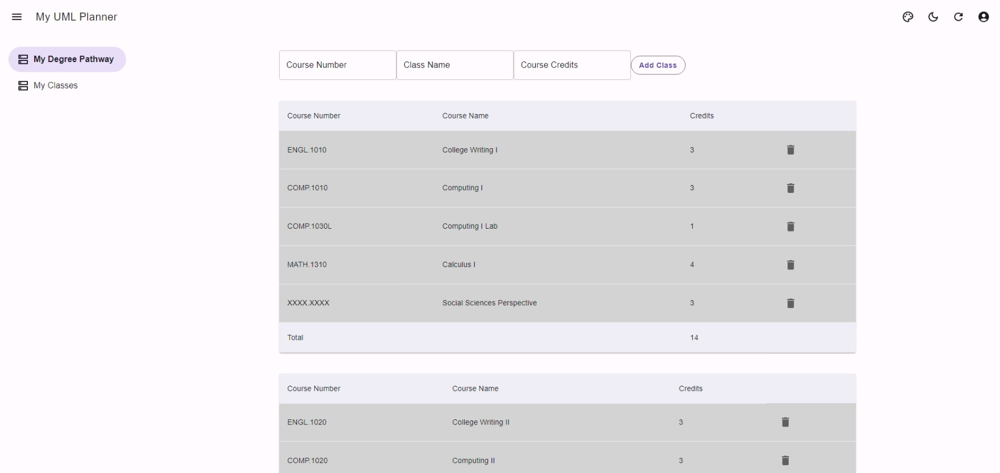

# My UML Planner

A course planner for students at the University of Massachusetts Lowell.

- Live demo: [https://www.cs.uml.edu/~mmarwad/my-uml-planner/](https://www.cs.uml.edu/~mmarwad/my-uml-planner/)

## Features

Some of the features below are planned and may not be functional at the moment.

- Degree course planner. Plan out the classes you want to take by semester, by dragging and dropping. The app will determine what classes you need to take in what order, but allow you to move classes around in the order allowed.
- GPA/grade calculator. Easily determine your final grade ahead of time.
- Intelligent class search. Get a detailed history of the past availability of classes.
- And more features planned.

## Build Instructions

Here is a step-by-step guide on how to build and run this app on your own machine:

1. Install Node.js and npm (Node Package Manager) on your computer. Node.js is a JavaScript runtime that is required to run React apps, and npm is a package manager that is used to install and manage the dependencies of the app. You can download and install Node.js and npm from the official website ([https://nodejs.org/](https://nodejs.org/)).
2. Clone the React app repository from GitHub to your local machine.

`git clone https://github.com/MartinMarwad/My-UML-Planner`

`cd My-UML-Planner`

4. Install the dependencies of the app using npm.

`npm install`

This will install all the packages and libraries that are required to run the app.

5. Run the app in development mode.

`npm start`

This will open a browser tab running the app in development mode.
